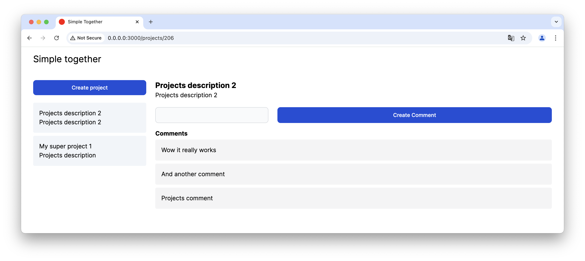

# Start development environment
```sh
docker compose run --rm app bin/rails db:create # Only one time

docker compose up
```

Open http://0.0.0.0:3000/ in a browser (may not work in Safari).

# Demo screenshot


